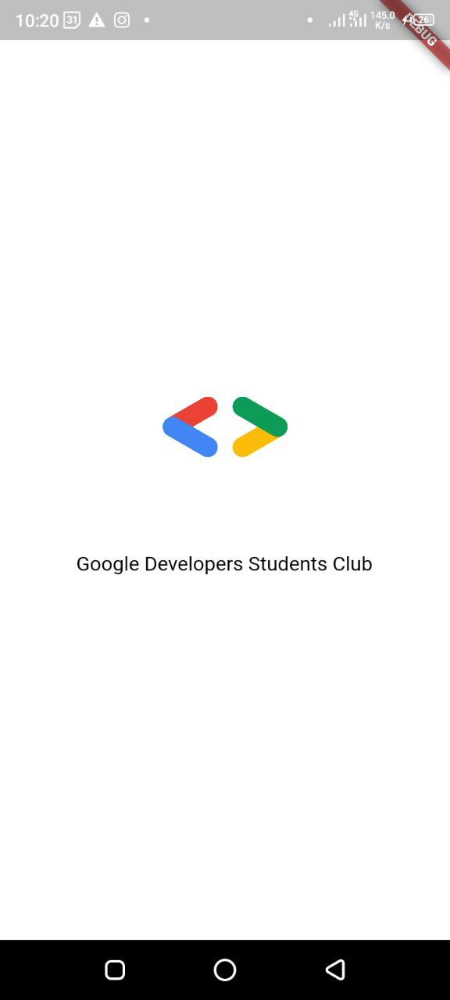
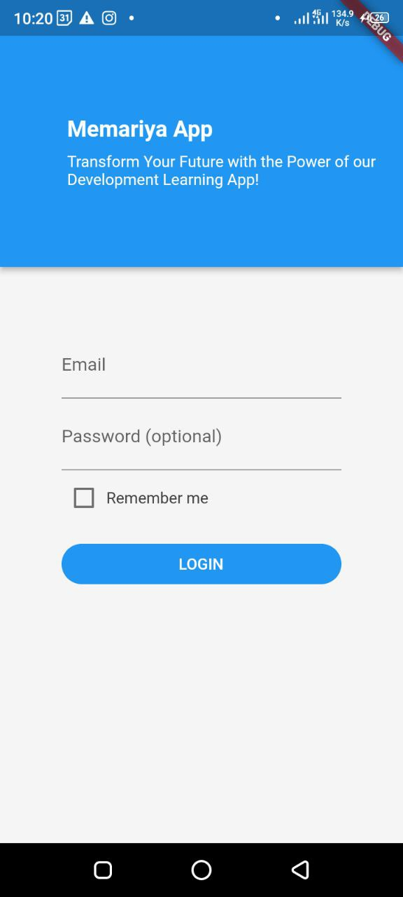

# Memariya Smart Learning App

  

Repository for **GDSC Mobile Study Session** capstone project template

This is a project-based mobile learning application designed to teach the Flutter framework. This repository was created by the Mobile Study Session Team from the Google Developer Student Club at Addis Ababa Science and Technology University.

The Memariya Smart Learning App provides a hands-on approach to learning Flutter through projects. Users can easily create their own customizations and modifications by forking the repository and adapting it to their needs.

# Features
Project-based learning approach
Hands-on experience with Flutter framework
Easy to use and customize
User-friendly interface
Responsive design
Getting Started
To get started with the Memariya Smart Learning App, you can either fork the repository or download the ZIP file. After downloading or forking, open the project in your preferred IDE and run the app on your device or emulator.

## Here Are A Few Screenshots From The App

# Contributing
Contributions are welcome! If you'd like to contribute to the project, please feel free to submit a pull request. You can also create issues if you find any bugs or have any suggestions for new features.

# License
This project is licensed under the MIT License. See the LICENSE file for more information.

# Contact
If you have any questions about the Memariya Smart Learning App or the Mobile Study Session Team, please contact us at @dscaastu. We'd love to hear from you!
